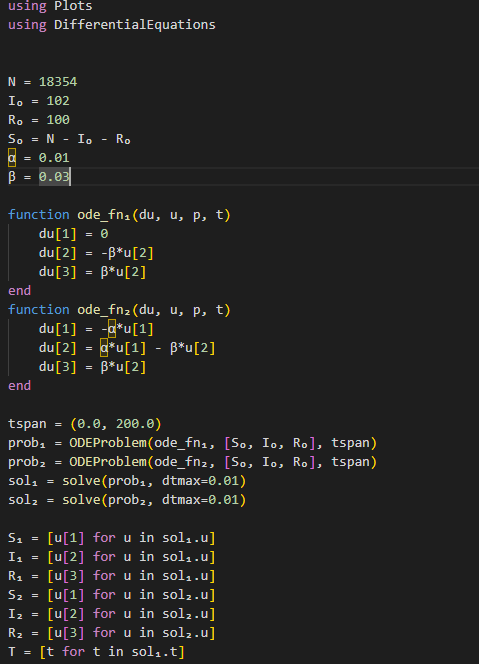

---
## Front matter
lang: ru-RU
title: Задача об эпидемии
subtitle: Лабораторная работа №6
author:
  - Покрас Илья Михайлович 
institute:
  - Российский университет дружбы народов, Москва, Россия
date: 2 марта 2023

## i18n babel
babel-lang: russian
babel-otherlangs: english

## Formatting pdf
toc: false
toc-title: Содержание
slide_level: 2
aspectratio: 169
section-titles: true
theme: metropolis
header-includes:
 - \metroset{progressbar=frametitle,sectionpage=progressbar,numbering=fraction}
 - '\makeatletter'
 - '\beamer@ignorenonframefalse'
 - '\makeatother'
---

## Цели

Целью данной работы является построение модели эпидемии.

## Задачи

Построить графики изменения числа особей в каждой из трех групп S, I, R. Рассмотреть,
как будет протекать эпидемия в случае:

1. $I(0) \leq I*$
2. $I(0) > I*$

## Ход работы

Код Julia(@fig:001 - @fig:002):

{#fig:001 height=75%}

## Ход работы

{#fig:001 height=80%}

## Ход работы

Результаты(@fig:003 - @fig:004):

{#fig:003 height=75%}

## Ход работы

{#fig:004 height=75%}

## Ход работы

Код на OpenModelica(@fig:005 - @fig:006)

{#fig:005 height=75%}

## Ход работы

{#fig:006 height=75%}

## Ход работы

Результаты(@fig:007 - @fig:008):

{#fig:007 height=75%}

## Ход работы

{#fig:008 height=75%}

## Результаты

В результате проделанной работы был написан код на Julia и OpenModelica и были построены математические модели зависимости численности особей трех групп S, I, R для случаев, когда больные изолированы и когда они могут заражать особей группы S.